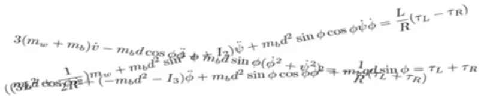
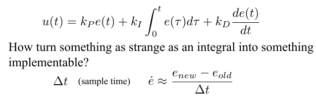

#Lesson 1 - Introduction to Controls

##  Lecture 1.1 – Control of Mobile Robots
####Multi-Robot Assignment and Formation Control
See [this video](https://class.coursera.org/conrob-002/lecture/2) (at 2:22)
See [more](http://www.youtube.com/user/GRITSlab)

### Control of Mobile Robots

### A Disclaimer

**Mathematics matters!**

***

## Lecture 1.2 – What’s Control Theory, Anyway?

### The Basic Build Blocks

System = Something that changes over time

Control = Influence that change

So let's start with trying to build up a control system in terms of the basic needed building blocks.

- The first thing you need is some way of describing what the system is doing or, more importantly, where it is. If I want to control a car, let's say I want to build a self-driving car that drives from my home to my office, well I need to know where the car is, and central to this is the notion of a state. The state represents what the system is currently doing, what state that it's in, and we're going to use x to describe what the state of the system is. This could be the position or the velocity of a robot, this could be the percentage of people that are infected by a certain, epidemic, this could be a number of different things, but ultimately the state is the key thing that describes what the system is up to.
- And what it is actually doing is the dynamics. And the dynamics is the description of the change of the state as a function of time.
-  But, we want some way of influencing this. So, we're going to have a reference signal that is going to. We're going to use it as a way of telling the system what it is that we want it to do. So the reference could be set the cruise controller to 60 miles per hour, or make me a certain amount of money on the stock market, or make the temperature in the room 70 degrees.
- What do I know? now we can do that all we want, but let's say that we want a cruise controller to go at 60 miles per hour, that's not going to work until we can actually measure how fast the system is going. So we also need an output. So we're going to use r for the reference, y for the output. And  the outputs are the things that we're able to get out of the system. This is telling us what the system is doing. We can't always measure the states.
- If I just you know yell 65 at my car, it's not going to go 65 miles per hour so we need some way of mapping reference signals into actual control signals, the inputs. So u is going to be the thing that takes the reference and produces a control signal that then hits the state of the system.
- Now this is all fine and good but this control design is not particularly good because the control signal has nothing to do with the measurements. So we need the final building block which is the feedback. This is a mapping from outputs to inputs. And then we're taking the reference and out here comes the reference minus y, which is going to be the error in terms of how the performance of the system is. And this error is translating into some control signal that's then hitting the system. So this feedback mapping is really the key to doing any kind of controls in an effective way.

***

## Lecture 1.3 – On the Need for Models

So now we have seen that controls deals with dynamical systems in generality. And robotics is one facet of this. Now what we haven't done is actually try to make any sense of what this means in any precise or mathematical was. And one thing that we need to do is to come up with models. And models are going to be an approximation, and an abstraction of what the actual system is doing. And the control design is going to be made, rather done, relative to that model and then deployed on the real system. But, without models we can't really do much in terms of control design. So, models are actually key when it comes to designing controllers.

**Control Theory = How pick the input signal u?**

There are a number of different kinds of objectives when you control a system.

### Objectives of control

- **Stability**, loosely speaking, means that the system doesn't blow up. So, if you decide a controller that makes the system go unstable, then no other objectives matter because you have failed if your robots drive into walls or your aerial robots fall to the ground. Basically ***control stability is always control objective number one***. Now, once you have that, the system doesn't blow up.
- **Tracking**, which means, here is a reference, 14, how do we make our system do 14 or here is a path how do I make my robot follow this path or how do I make my autonomous self driving car follow a road.
- **Robustness**. Since are dealing with models when we're doing our design. And models are never going to be perfect. We can't overcommit to a particular model. And we can't have our controller be too highly dependent on what the particular parameters in the model. So, what we need to do is to design controllers that are somewhat immune to variations across parameters in the model, for instance.
- **Disturbance rejection**. We are going to be acting on measurements. And sensors have measurement noise. This always happen if you're flying a plane in the air, all of a sudden you get a wind gust. Now that's a disturbance. If you're driving a robot, all of a sudden you're going from Linoleum floored carpet, now the friction changed. So all of a sudden you have these disturbances that enter into the system and your controllers have to be able to overcome them. At least, reasonable disturbances for the controllers to be effective.
-  **Optimality**, which is not only how do we do something but how do we do it in the best possible way. And best can mean many different things, it could mean how do I drive from point A to point B as quickly as possible, or as little fuel as possible or while staying as centered into the middle of the road as possible. So optimality can mean different things and this is typically something we can do on top of all these other things.

Effective controlled strategies rely on predictive models. Because without them, we have no way of knowing what our control actions are actually going to do. So, what do these models look like? Let's start in discrete time.

### Discrete Time Models

This is known as **a difference equation** because it tells you the difference between different values across different time instances.
This would be the world's simplest model. There are no control signals or anything in there. But it least it is a dynamic discrete time model.
Now the problem we have with this though is that **the Laws of Physics are all in continuous time**. And when we're controlling robots we are going to have to deal with the Laws of Physics. Newton is going to tell us that the force is equal to the mass times acceleration. Or, if we're doing circuits, Kirchoff's Laws is going to relate various properties to capacitances and resistances in the circuit. So, we're going to have to deal with things in continuous time, and in continuous time, there is no notion of next.

### Dynamics=Change Over Time

So **in continuous time, we don't have difference equations**. What we have are these things called **differential equations**.
And right here you see that the derivative of the state with respect to time. So this not telling me what the next value it is. It's telling me, what's the change? Instantaneous change.

We are going to need, almost always, continuous-time models for our systems. And next couple of lectures, we're going to start developing models of particular systems.

### From Continuous to Discrete

But, before we do this, I want to say a few words about how to go from continuous time to discrete time:

This is known as a tailor approximation. This is a way of getting a discrete time model from the continuous time model. And, this is how we're going to have to take the things we do in continuous time, and map it onto the actual implementations of computers that ultimately run in discrete time.

***

## Lecture 1.4 - Cruise-Controllers

So now that we have a way of describing dynamical systems with differential equations in continuous time. Or difference equations in, discrete time. Let's, see if we can actually use this, to do something interesting with robots. And, let's start with building a cruise controller for a car. **The cruise controller's job is to make the car drive at the desired reference speed.**

Now, we want to somehow understand how we should model the car so that we can make it go the reference speed. The laws of physics ultimately will dictate how objects in the world, like robots or cars, behave. And Newton's second law says

***F=ma***.

Now, this is what we're going to have to start with. There's nothing we can do about this. It is what it is.

Now, what is the state of the system? We need to somehow relate Newton's Second Law to the state. In this case, since what we're going to do is try to make the velocity do the right thing, we can say that, let's say that the velocity of the car is the state. So x is going to be the speed at which the carrist is driving.
Now we're also going to have to have an input, and when you're driving a car, the input, if you're dealing with, with speeds rather than which direction the car is going is, you press the gas pedal or the brake. Somehow we're mapping stepping on the gas or the brake onto a force that's applied to the car. And this is done through some linear relationship. And I'm going to go out on a limb and say, we don't know what this is. And, I control this sign cannot rely on us knowing c, because we're not going to know exactly what it is. But, let's at least for now, go with this, and hope that's good enough to give us the design we want.

A very complicated robot, a car, and the model we came up with was very simple, and the point is that simple models a lot of times get you very far. So, let's see how we should actually do the control design here.

### Control Design

Our job, as control designers, is to make the error e disappear, drive the error down to zero.
Note, **jerky**, here. All I mean with that is that, **it shouldn't vary too rapidly all the time**. Because if it does, then we're going to be sitting in this car. With our cruise controller, we're going be having a cup of coffee with us. And, now the cruise controller is smacking us around all over, because it's jerking, we're going to spill our coffee. And, in fact for auto pilot's on airplanes, there are limits on their acceptable accelerations that are directly related to cups of coffees standing on the tray tables in the aircraft.
And it should not depend on us knowing c and m. So, m is the mass of the car. C is this semi-magical transmission coefficient. The mass of the car is changing depending on what luggage we have. It's changing depending on how many passengers we have. We should not have to redesign our controller just because a new person entered the car. We shouldn't have to weigh everyone and enter how much we weigh to, for it to work. And in fact elevators have bounds on how many people can be in the elevators. This is important, related to the fact that they design controllers that are **robust to variations** in mass across a certain spectrum.

***

### Lecture 1.5 – Control Design Basics

Let's start designing controllers.

### Bang-Bang Control

Is this going to work or not?

I'm calling this bang-bang control and that's actually a technical term from doing things like u max and negative u max. You're switching between two extremes.

Now, let's see what the control signals is actually doing:

It is miserable. Even though the car was doing the right thing in terms of the velocity, I had u max be a 100, so negative max is minus a 100 and first of all, we are accelerating up for a while, until we hit the right velocity. And then, we start switching wildly between plus and minus a 100. Well, when the error was 0, the u was supposed to be 0, but the error is never going to be exactly 0. We get a really bumpy ride. We're going to be tossed around in the car, backwards, forwards, backwards, forwards, because of all these accelerations that are being induced by these, these extreme control signals. We're also burning out the actuators.

So, this is actually not a particularly good control design. And the problem is **overreaction to small errors**.
Even though the error is tiny, as long as it's positive, we're slamming gas as hard as we can. so we somehow need to change this design. So, how shall we do that? Well, the easiest thing to do is to say, you know what, when error is small, let's have the control signal be small. In fact, here's my second attempt.

### P-Regulator

This is what the P-regulator in action looks like:

So, it's nice and smooth, right? It seems even stable. But it says 60 and I had my reference be 70. So, even though we're nice and smooth, we actually **did not hit the target value**. We're **not achieving tracking**.

### Stability But Not Tracking

So, something is lacking and next time, we're going to see what it is that is lacking to actually achieve tracking and stability.

***

## Lecture 1.6 – Performance Objectives

### Performance Objectives
- **Stability**
  (**BIBO**, what it stands for is, bounded in, bounded out which means that if the control signal is bounded, the state of the system should also be bounded. What this means is that, by doing reasonable things the system doesn't blow up)
- **Tracking** means we should get to the reference value we want.
- **Robustness** means we shouldn't have to know too much about parameters that we really have no way of knowing.
- **Noise rejection**. Preferably we should be able to fight noise as well.

  So recall when I introduced the wind resistant term, we had a little bit of a problem. The proportional regulator couldn't overcome it and let's have another controller done one that explicitly cancels out the effect of the wind resistance.
  

Well, we have stability and we have tracking, but we don't have robustness. Here are three things that we don't know. Gamma, m, and c. And our controller depends explicitly on these coefficients. So all of a sudden we have to know all these physical parameters that we don't know, so this is not a robust control design. So Attempt 3 is a failure.

Okay, let's go back to the P-Regulator and see what's going on there.
What, what's actually happening is that the proportional error is doing a fine job pushing the system up to close to where it should be, but, then it kind of runs out of steam, and it can't push hard enough to overcome the effect of the wind resistance. So the proportional thing isn't hard enough. Note error starts accumulating over time, so if we're able to collect all of these errors over time, even though they are very small. Over time, that should be enough, so that we can use this now accumulated error to push all the way up. So I wish there was some way of collecting things over time in a plot like this:

So, if we take the integral over the error we're collecting the error over time and over time as this errors going to accumulate it's going to give us enough pushing power to actually overcome the wind resistance.

### PI Regulator:

And it is 2/3 of the most common regulator found anywhere in the world.

Let's see it in action and see what it actually does:

And if I use just the PI regulator. So this solves the problem. I don't know parameters, so it's robust. I'm achieving tracking, because I'm getting to 30 miles per hour. And, I'm stable in the sense that I didn't crash. So, this seems like a very useful design.

***

## Lecture 1.7 – PID Control

Today I want to talk a little bit more about PID control. And, the reason for that is, this regulator is such an important regulator or controller that's out there in virtually every industry you can think of, there is a PID regulator going on underneath the hood in almost all controllers.

I want to talk a little bit about what are the effects of these gains:

- **P**. It's a contributor to stability. In the sense that, it makes the system, ***not guaranteed, but it's helping out to make the system stable***. And it's making it responsive. It drives the system towards that value. I'm calling it ***medium rate responsiveness*** because it's not super fast. And the speed. In fact, the rate of responsiveness is a function of how big kp is. But as you saw, it wasn't typically enough to achieve tracking.
- **I** component is really good for ***tracking*** and in fact if your system is stable than having an I component is enough to assure tracking in almost all cases. It's also ***extremely effective at rejecting disturbances*** so that integral part is a very effective part to have in your controller. Now it's ***much slower*** in the sense that you have to accumulate over time errors to respond to them because it's an integral. So it responds slower and there is a little bit of a warning I need to make there, **by making ki large**. You may very well **induce oscillation** so you have to be a little careful in how you actually select these gates.
- **D**. Since it's not responding to actual values, but the changes. It's typically ***faster responsiveness***, so something is about to happen. Well, the rate is changing so the derivative part kicks in typically faster. Now there is a little caveat to this. The derivative is ***sensitive to noise***. Because if you have a signal that's noisy then if you compute the derivative of that signal you're going to get rather aggressive derivatives that don't necessarily correspond to what the non-noisy signal would be. So you have to be a little careful with the d part. So making Kd too large is typically an invitation to disaster because you're over reacting to noise.

So, the last thing I want to point out though is when you put this together you get PID which is already by far the most used low level controller. Low level means whenever you have a DC motor somewhere and you want to make it do something somewhere there is a PID leak. Whenever you have a chemical processing plant for getting the right concentrations in your chemicals, somewhere there is a PID regulator. It's almost everywhere there, or in almost all control applications, PID shows up under the hood in some form or another.

But, I do want to point out, that this is not a one-size-fits all. We can't guarantee stability with a PID regulator. Sometimes it's not enough. In fact, when we go to complicated robotic systems, the PID regulator will typically not be enough by itself. So we need to do a lot of more thinking and modeling to use it and at this point we actually don't really know how to pick these gains.

And since it is a feedback lob because it depends upon the error it actually fights uncertainty model parameters in a remarkable way and the feedback has this remarkable ability to overcome the fact that we don't know gamma, we don't know c, we don't know m. But still, we seem to do well when we design controllers for a wide range of these parameters.

### Cruise-Controller (Again)

So having said that, let's hook it up to our car and in fact we had a PID regulator for velocity control on the urban challenge vehicle:

We had this model that we've already seen, and I pick It's completely random and arbitrary numbers here for the parameters. I even put r equals to 1, so we're going to go 1 mile per hour. let's say 1 meter per second. It really doesn't matter. These are arbitrary values. Just so you'll see what's going on. So, if we start with our friend The p regulator. This we had already seen:
#### P-Regulator

So the p part by itself was not enough to both be stable and achieve tracking. Well, that's Ok in the i part. 

#### PI Regulator

so then this thing makes it's way up and it stays up there perfect. So this is actually a good and successful design right here.

Now ,if this is so good why don't we make ki higher to make it even better? Well if I To crank up KI to 10:

Then, all of a sudden, my system starts oscillating. So this is an example of where the integral part may actually cause oscillations. Which is, we should at least be aware of this fact. And be a little careful when we tweak our parameters. And if we see oscillations that is a clear indication that the integral part is typically a little bit too large.

What about the d part? Well, let's add the d part:

#### PID Regulator

In this case, it actually doesn't matter too much. What you see here is that I had a small d part. I'm a little bit paranoid when it comes to large kd terms because they are a little bit noise sensitive. But what you're seeing here is that you're getting **a faster initial response** because of the introduction of a D part, but then, we actually get almost **a slower response towards the end**. So in this particular application, having a d gain it's not clear if that was useful. But this is some of the thinking that goes into tweeking PID regulators.

***

## Lecture 1.8 – Implementation

How do we go from this mathematical expression to something that's running on a platform? Well, the first thing to note is that, we always have a sample time. We're sampling at a certain rate. There's a certain clock frequency on the computer. Well, what we need to do is to take these continuous time objects that we have here in the PID regulator and have them be defined in this discrete time.

### Implementation

We're going to do altitude control.

### Example: Quadrotor Altitude Control

