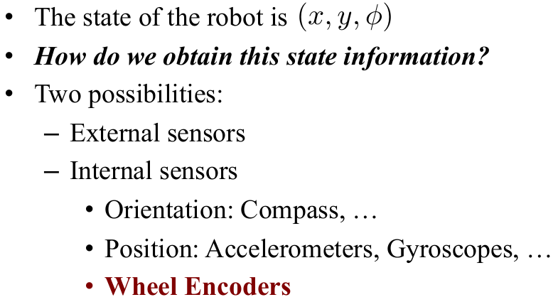
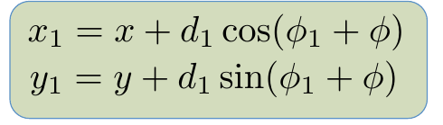
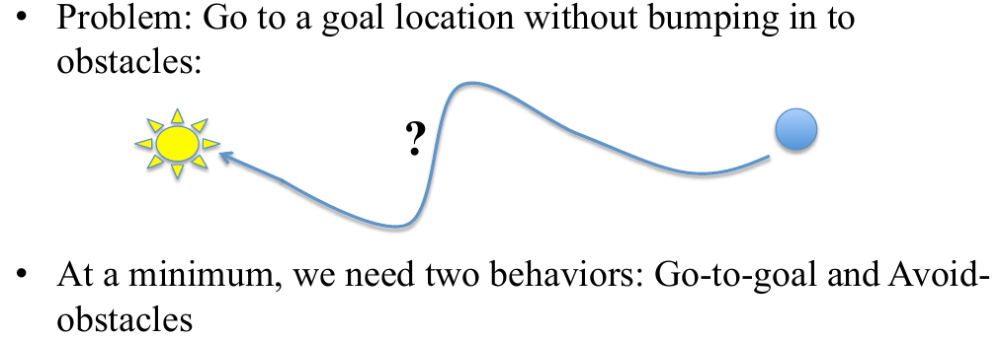

# Lesson 2 - Mobile Robots

## Lecture 2.1 – Driving Robots Around?

### Divide and Conquer

### Behaviors

The robot used camera information to build up a map of what the world looked like. Most of time it follows a plan behavior and then when something pops up, it switches to an avoid-obstacle behavior. Instead of the robot sitting around thinking for a long time, it just avoids it. And once it's clear, it goes back to following the plan. So, this would be an example of why behaviors are really useful. 

This is actually a segway robot, so the dynamics is very complicated. This robot is actually switching between different arc behaviors. So, there are different arcs that the robot can take and the behaviors are follow various arcs. So now, you can put behaviors that are not as simple as just go-to-goal and instead, the behaviors would be arcs of various sizes and shapes. And we will become quite good at understanding how to design these individual behaviors, and as well, how to combine them.

## Lecture 2.2 – Differential Drive Robots

The differential drive wheeled mobile robot has two wheels and the wheels can turn at different rates and by turning the wheels at different rates, you can make the robot move around.

### Model 1.0 - Differential drive wheeled

Here's a cartoon of the robot.

We can measure the dimensions of the robot but actually they play a little bit of role when we try to design a controller for the robot because of the robustness criteria. 

In fact, we want to be able to control how the robot is moving. But, at the end of the day, the control signals that we have at our disposal are v sub r, which is the rate at which the right wheel is turning. And v sub l, which is the rate at which the left wheel is turning. And these are the two inputs to our system. Now, what are the states? Well, here's the robot. 

Now, I've drawn it as a triangle because I want to stress the fact that the things that we care about, typically, for a robot is where is it(x and y, it's the position) and which direction it is heading in. So, phi is going to be the heading or the orientation of the robot. So, the robot model needs to connect the inputs to the states. So, we need some way of doing this transition. 

This is a model that gives us what we need in terms of mapping control inputs onto states. The problem is, that it's very cumbersome and unnatural to think in terms of rates of various wheels. If I asked you, how should I drive to get to the door, you probably not going to tell me how what v sub l and v sub r are, your probably going to tell me don't drive too fast and turn in this direction. Meaning, you're giving me instructions that are not given in terms of v sub l and v sub r, which is why this model is not that commonly used when you're designing controllers. However, when you implement them, this is the model you're going to have to use. So, instead of using the differential drive model directly, we're going to move to something called the unicycle model. And the unicycle model overcomes this issue of dealing with unnatural or unintuitive terms, like wheel velocities. 

### Model 2.0 - The “Unicycle” Model

I care about position. I care about heading, why don't I just control those directly? In the sense that, let's talk
about the speed of the robot. How fast is it moving and how quickly is it turning?

If I have that my inputs are going to be v, which is speed, and omega, which is angular velocity.

So, if we have that, how do we map them on to the actual robot?

And with these parameters, you can map your designed inputs, v and omega, onto the actual inputs that are indeed running on the robot. So, this is step 1, meaning we have a model. Now, step 2 is how do we know anything about
the world around us?

## Lecture 2.3 – Odometry

### Wheel Encoders

### A Major Disclaimer

## Lecture 2.4 – Sensors

### Range-Sensor Skirts

### The Disk Abstraction

If we know our own pose(position and orientation):
 

So we have know globally where the obstacles are.

## Lecture 2.5 – Behavior-Based Robotics

### Building a Behavior v.1

However, this won't work at all!

### Dealing with Angles

### Example: Navigation

## Lecture 2.6 – Go-To-Goal

### Attempt 1

Forgot I was dealing with angles.

### Attempt 2

Gain Too Low!

### Attempt 3

Just Right!

## Lecture 2.7 – The GRITS Robot Simulator

## Lecture 2.8 – Obstacle-Avoidance

### Where to Go?

### Arbitration Mechanisms

