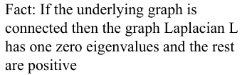
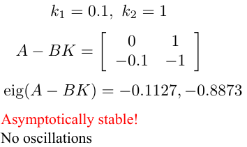

# Lecture 3 - Linear Systems

## Lecture 3.1 – A Simple Robot

### “Controlling” a Point Mass

### On State Space Form

### A 2D Point-Mass

### LTI Systems

## Lecture 3.2 – State-Space Models

A describes the physics of the system. It's given so we can do very little about it.
B tells us how the inputs affect the states. It means what actuators we have.
C encodes what sensors we have. Meaning how can we actually get information about what's going on inside the system.
So, A is given. Typically, B and C redesigned when we designed the system.
And the question that all of control theory is really about how do we pick this input to make the system do what it should be doing? And, more importantly, since we only can measure y. How do we pick u, given y?

### Example 1: The Car Model

### Example 2: Pendulum

### Example 3: Two Simple “Robots”

## Lecture 3.3 – Linearizations

### Computing the Jacobians

### Example: Inverted Pendulum

### Example: Unicycle

### Punchlines

## Lecture 3.4 – LTI Systems

### Solving the ODE

### Matrix Exponentials

###Solving the Controlled Equation

### In Summary

## Lecture 3.5 – Stability

The first order of business is to design controllers so that systems don't blow up. If they blow up, there's nothing we can do about it:
- The quad rotors just fall out of the air. The robots drive off to infinity.
- The cars smash into things.

We don't want them to blow up, because the deciding objectives are almost always layered in this sense:
1. First order of business is ==stability==.
2. Then we want to ==track== whatever reference character or reference point we have.
3. We also want it to be ==robust== to parameter uncertainties, and possibly noises.
4. And then we can wrap other objectives around it, like when you want to move as quickly as you can, or use as little energy when you're moving, or things like this.

But, regardless of which, stability is always the first order of business.

###Scalar Systems

So let's start with scalar systems, no inputs. So only the A matrix now, in this case
$$\dot{x}=ax$$
which means that it's scalar. Well then the solution x(t) is
$$e^{a(t-t_0)}x(t_0)$$
Here I simply picked t naught to be equal to 0. So this is the solution:
$$e^{a(t)}x(0)$$
Okay, lets plot what this solution looks like. If a is positive, then x of t it starts nicely and then it's blowing up. So if a is positive this system blows up.

Well, if a is negative, then e to the at, this is a decaying exponential. So we get x to just go, nicely down to zero.

What happens if a is zero in between these 2? Well, then you have e to the zero t, which is 1. So then, x of t is simply equal to x naught. x never changes.

So here, it didn't blow up, but it didn't actually go down to zero. Three possible things can happen: you blow up, you go down to zero, or you stay put. So let's talk about these three cases:
1. The first case is what is called ==asymptotic stability==.
So the system is asymptotically stable if x goes to zero for all initial conditions, this is known as the universal quantifier.
2. And then we have ==instability== where the system being unstable.
3. Lastly  we have something we call ==critical stability==, which is somehow in between. The system doesn't blow up. But it doesn't go to zero either, and in fact, for the scalar system, this corresponded to a equals to zero case.

So if you summarize that, if you have a scalar system then a positive means the system is unstable; a negative means that the system is asymptotically stable, which is code for saying that the state goes to zero. And a zero means critically stable.

###From Scalars to Matrices?
X is a vector, A is a matrix. A is not positive or negative. But we can deal with the eigenvalues. And, in fact, almost always, ++the intuition you get from a scalar system translates into the behavior of the eigenvalues of these matrices++.

Note, $$$\lambda$$$ typically is a complex number. So it's a slightly more general object than just a real number, but that's an eigenvalue. And v is known as an eigenvector. And eigenvalues and eigenvectors are really these fundamental objects when you're dealing with matrices and when you want to understand how they behave. And, whenever you think scalar first, you can almost always translate it into what eigenvalues do for your systems. So, you can almost think of them as scalar systems in the directions of the different eigenvectors.

The eigenvalue corresponding to v2 is -1, so if I start here, my trajectory is going to pull me down to zero. Nice and stabl So, if I'm starting on the x2 axis, my system is well behaved.

If I start on the x1 axis, I have lambda 1 being positive, which corresponds to little a being positive in the scalar case, which means that the system actually blows up. So, here, the system goes off to infinity.

And, in fact, if I start here, my x2 component is going to shrink but my x1 component is going to go off to infinity. So what I have is this is what the system actually looks like the picture below:

So the eigen vectors in this case will tell me what happens along different dimensions of the system.

But we are going to spend most of our time in the asymptotically stable domain, because what we want to do, is we want to design our system in such a way that the closed loop system is asymptotically stable. So we're going to somehow make the eigen values have negative real part.
So, let's end with a tale of two pendula. Here is the normal pendula

We have critical stability here. What this actually means is that, this pendulum, clearly, there is no friction or grav-, or damping here. It's just going to oscillate forever. It's not going to blow up. And it's not going to go down to zero. It's just going to keep oscillating forever and ever. It's critically stable system.

Now, let's look at the inverted pendulum.

We already know, this thing is going to fall over. we have one Rothton eigenvalue. This eigenvalue that's going to spoil the system. So this is an unstable system.

## Lecture 3.6 – Swarm Robotics
So, in the previous lecture, we saw that eigenvalues play a fundamentally important role when you want to understand stability properties of linear systems.

###The Two-Robot Case

If you don't have global positioning information, you don't know where you are so there's no way you're going to know, globally, where this thing is, but you know where your neighbors are locally. And the Rendezvous Problem is the problem where having all the agents meet at the same position. You don't want to specify in advance where they going to meet because since they don't know where they are, they don't know where they going to meet. They can say, oh, we're going to meet in, at the origin. But I don't know where the origin is. So, the point is, we're going to meet somewhere, but we don't know where. Okay. So, we have actually solved this problem before.

Well, if we do that, we can actually write down the following system.

This is the closed loop system now, where we have picked that controller.Okay, let's see if this works now-we ++check the eigenvalues of the A matrix++ to see what's going on.

Because we said asymptotic stability means that both eigenvalues need negative real part, this doesn't have that. But asymptotically stability also means that the state goes to the origin however we don't know where the origin is, so why should we expect that? We should not expect it. We also know that one positive eigenvalue or eigenvalue with positive real part makes a system go unstable. We don't have that either. In fact, what we have is this in-between case that we called critical stability. We have one 0 eigenvalue and the remaining eigenvalues have negative real part. So, this is critically stable.

That's where your going to end up. So, you're going to end up inside this thing called the null space of A, in this case, because you have one 0 eigenvalue and all others having strictly negative real part. And if you type null(A) in MATLAB, you find that the null space for this particular A is

Okay, what does this mean for me? Well, it means that x is, x1 is going to go to alpha and x2 is going to go to alpha, which means that x1 minus x2 goes to 0 because they go to the same thing. Which means, that we have, ta-da, ++achieved rendevous++. They end up on top of each other. In fact, they end, end up at alpha. We don't know what alpha is but we know that they end up there.

###The Multi-Robot Case

Now, if you have more than two agents, we simply do the same thing. In this case, we aim towards what's called the centroid of the neighbors.

That is doing the same thing if you have more than one agent.

And this is just some bookkeeping. L is known as the ++Laplacian of the underlying graph++. Meaning, who can talk to whom. that's not so important. The important thing though is that we know a lot about this matrix L and, again, and it's called the ++graph Laplacian++. And the fact is

But we have negative L here, which means that negative L is one 0 eigenvalue and the rest of the eigenvalues are negative. That means that this system here, the general multiagent system here is actually critically stable. And we know that it goes into the null space of L. And it turns out, and this is a fact from something called algebraic graph theory. We just know that clever graph theoreticians have figured out that the null space to L, if the graph is connected which means that there is some path with, through this network between any two agents is given by not alpha, alpha but alpha, alpha, alpha, alpha, alpha, a bunch of alphas.

It doesn't have to be scalar agents, what I do have is that all the agents go to the same alpha or in other words, the difference between the agents will actually disappear. And when we did this, we design a controller. And this thing is so useful that it actually has its own name. It's known as the consensus equation because it makes agents agree. In this case, they were agreeing on position. But this equation actually will solve the rendezvous problem because of the fact that the corresponding system matrix you get is negative L at the right eigenvalues which means that the system is critically stable so we can solve rendezvous in the multirobot case.

## Lecture 3.7 – Output Feedback

We typically don't want critical stability. We want asymptotic stability. Which means that we need to have strictly negative real part of all the eigenvalues here. And today, we're going to actually achieve that, or try to achieve it, by designing a controller.

Whatever we do to our control choice has to depend on the things that we have access to. We don't know the state of the system. But, we certainly know the output. So, today we're going to try something called ++output feedback++, which means we're going to take the output of the system and use it to feed directly back in as a way of controlling it.

###Back to the World’s Simplest Robot

So now our job is to somehow connect y to u, meaning pick our input in such a way that this system goes to zero, which means stabilizing it. So, why don't we move towards the origin?

And our job is to drive it to the origin. So if the position is negative. Meaning we're on the left of the origin. We should probably move to right. If the robot is on the right of thr origin, we should move it to the left, which is in a negative direction. So that's a very, very simple idea. And in fact if we turn it into math:

So let's try this, and see what it actually does. And what we need to do first is understand. How does this change the system dynamics?

Note here we use K because it's more general. Of course K could be 1.
So $$$\hat{A}$$$ is just a new system matrix and of course our job is to pick K now so that's the real part of the eigenvalues of $$$\hat{A}$$$ is strictly negative.

So that's really our job here and in a way already picked K, we said K was equal to one. Well let's see what's happening if that's the case

And this is for my particular choice of k. And let's check out what, what the eigenvalues are of this thing. As we will see in future lectures, you can actually compute it and, and say something about the clever choice of K in that way.

So is this system asymptotically stable? No. I have a critically stable system. And in fact since I have imaginary components, we have already hinted at this that what we actually end up with are oscillations. So this is a ==critically stable system== and if I simulate with this role, what it's doing is just going back and forth, back and forth.

So,

We clearly did not stabilize it, we know it's not asymptotically stable in fact it's just going back and forth back and forth. Well here is the problem, when the robot is away from the origin, then we're pushing it towards the origin. But when it's on it's way back, we're still pushing it equally hard, even though it's actually going there almost by itself. So, we're kind of not taking the direction in which the robot is going into account. What this actually means is that we are not looking at the velocity because the velocity is going to tell you which direction it is going in. So the problem is that we do not take velocity into account.
The state is position and velocity. So the problem is that we need all of them to stabilize the system meaning we need the full state information, not just the output. So output feedback like this doesn't quite work, but instead we want to operate on X instead of y. But here of course is the problem. How do we do that? And the corollary to that is, we don't even know x. We only know y. How in the world can we design controllers for things that we don't know? Well, as we will see in the next module, it's possible to figure out X from y. If you just think of y in this case as being the position and X being position in velocity. Then we can get velocity by measuring two positions after each other, and dividing it by the time in between the measurements. Then we get an estimate of the velocity. So, it's clearly possible in this case to at least get an estimate of state from the output.
In the next lecture we will pretend that we actually have X and revisit the world's simplest robot and see how can we actually stabilize it if we have all of x and not just y.

##Lecture 3.8 – State Feedback

- The outcome of last lecture was on one hand a little bit exciting because what we did is we took the measurements that we get and we try to use them as a way of designing controllers to stabilize the system. We actually know how to stabilize systems. We need the real parts of the eigenvalues are all strictly negative.
- On the other hand, the outcome of the last lecture was wildly disappointing because we couldn't actually do it. And the reason for that was that we only looked at the output and not at the full state information.

So today, we take all of X into account, and not just y. What we're going to do today is simply say, I don't care about y. In fact, forget about measurements. What comes out here is X itself.

The topic of the next module is to create a way of actually sucking out x from y but for now let's just pretend for a moment that we do have access to the full state information.

Well if we have that we don't have to worry about y ever. Then what we do is instead of saying u is negative Ky, we're now going to say u is negative KX, where K is the matrix of various gains in it. In the previous example, it was just a scalar with an 1 in it, but in general it could be a matrix. Now, just like last time, we plug this choice of u back into the equation for x:

Well in particular A hat is known as the closed loop dynamics because now we have closed the loop of the system. We're feeding back the state information into the system.

*The entire module 4 is going to be devoted to this question. How do we pick K such that we can stabilize this system, get the eigenvalues we want? And on top of that, how do we get around this rather peculiar conundrum where we only have y but we would like to have X and we're going to pretend that we have X.*

So, let's go back again to our simple robot to see how can we understand this in the context of the simple robot.
###Dimensional analysis

where m is the dimension of the output and the n is the dimension of the state.

We pick k1 and k2 here, those are our control gains

So, in the next module we'll be systematic in terms of how we actually pick this case. For now let's just pull some case out of a hat. Oh, and I'm a lazy man, so I'm pull once out of the hat. So let's just try below

- Well the real parts of the eigenvalues are strictly negative, which of course is what we needed for stability. So we have asymptotic stability.
- The other thing to note is that we have an imaginary component to our eigenvalues, that means that we can expect oscillations in the way the system behaves.

So we have an asymptotically stable system with some oscillations floating around, and they are in fact damped oscillations because, since the system is stable, the oscillations are going to become smaller and smaller in amplitude, and as t goes to infinity, they are going to in fact go away completely.

As you can see from the [video](https://class.coursera.org/conrob-002/lecture/26) very quickly we get close to the origin we overshot a little bit and this because of these osculations.

So let's see if we can do something about these oscillations. Well here is another attempt completely arbitrary. I am going to make k1 smaller which means k1 tells me how much I react to position and k2 tells me how much I react to volicity. You can almost think of k1 as a p parameter in a PID regulator, and k2 is the d parameter in the PID regulator.

- The eigenvalues end up being these 2 negative numbers, which means we cannot expect, really, any oscillations.
- They are strictly negatives.

So this is an asymptotically stable system with no oscillation. So, this seems like a pretty decent design to me. Let's see what it would actually do to the robot(see [this video](https://class.coursera.org/conrob-002/lecture/26)).

It's not oscillating but it's unbearably slow. So, what we saw here is that we actually got rid of the oscillations but it was much more sluggish and borderline annoying from a performance point of view.

But for now asymptotic stability is achieved and what we saw we need to do is to be able to achieve stability while doing other things at the same time.

But one thing that is absolutely clear

