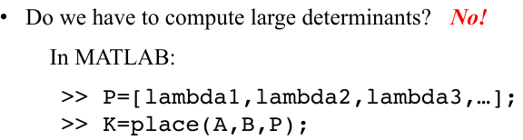
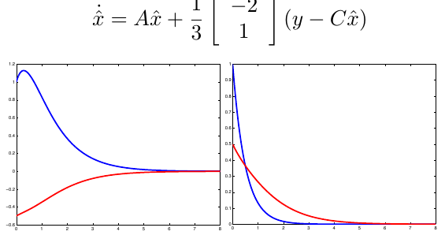

#Lecture 4 - Control Design

###Learning Objectives:
1. Understand how the closed-loop eigenvalues relate to stability and performance
2. Design of state feedback controllers and observers using pole-placement
3. Apply the separation principle to general, linear systems

## Lecture 4.1 – Stabilizing the Point Mass

In the last module we've learned  about linear systems and we saw where  they came from and at the end we even managed to control them a little bit   because we could design a state feedback  controller for a point mass that  stabilized it, but at the same time we  were a little queasy and uneasy about  this whole thing because we had to have x  meaning the state to do our control  design but in reality, we actually don't  have x. We have y, the output.

But before we do that we actually need  to figure out how do we computer  eigenvalues?

Turns out that the answer is, yes.
==We only care about the signs of $$$\lambda$$$==
There is something called the ++fundamental  theorem of algebra++: the roots of a polynomial  are determined by the coefficients. So I actually  don't have to solve this equation. The  coefficients alone are enough to  implicitly but completely determined  eigen values.  So what we're going to do is we're  actually not going to solve this.  We're just going to stop here and say,  fine.

So we go back to our point mass again.

* * *

##Lecture 4.2 – Pole Placement

Now, the first answer is, unfortunately.  This isn't magic, we can't always do it.  So, what we need to understand is in fact  when we can do it and when we cannot do  it.

Unfortunately there isn't a recipe book  that says here are the eigenvalues you  need to use.  In fact, it's a little bit of an art and  science, and the design choices that we  make ultimately boil down to the choices  of eigenvalues.  So we have to discuss a little bit about  how we pick our eigenvalues.

We don't know what controllability is yet but that's something to be aware of. Now, let's pretend that we could do it though.

- If the eigenvalues have a non-zero imaginary part. There has to be another one that is the complex conjugate pair of this because eigenvalues have to show up in conjugate complex pairs if indeed they are complex. So that's the first thing that we should keep in mind, that we can't just assign one complex eigenvalue. We have to assign two, if that's the case.
- The other thing is, of course, we need the real part of the eigenvalues to be strictly negative, because otherwise, we don't have asymptotic stability.
- The other thing to know is that if, indeed, we keep an imaginary part around, we get oscillations. If that's something we would like, typically we don't, but, so if you don't like oscillations the eigenvalues we pick are all real. If for some reason wanting oscillations, then we have to introduce. imaginary parts.
- And the last thing is that the choice of eigenvalues actually affect the rate of convergence, meaning how quickly the system is stabilized.

So what you could do, is if you make all your argmin values equal to minus a million, then you have a really, really, really, really fast system. The problem is that if you make them really, really really fast you get really large control signals which means that any physical actuators going to saturate.So, you don't wanted to go super fast because then your saturated actuators so it's that what we need to do is some how play around with these things to balance a low bit between how fast or how slow you want your systems to be versus what size the control signal should be.

- Poles are [-0.1+1i, -0.1-1i]

we see that we have a system that slowly, slowly, decays down to 0, possibly. But, there are oscillations going on there, right? Clearly, because I have imaginary eigenvalues.

- Poles are [-0.5+1i, -0.5-1i]

This is the new system it's still oscillating but it's quicker getting down to 0 which is what we would expect.

- Poles are [-0.5, -1]

See here. No oscillations. We're decaying down to zero, quite nicely. But, maybe we're thinking that this is a little bit too slow. So let's pick some other eigenvalues here.

- Poles are [-4, -5]

Bam, very quickly down to 0, tiny bit of overshoot, And then we're stabilizing.

##Lecture 4.3 – Controllability

And the question one can ask then is, can I do that? Is it possible? Does there exist such a u?

This is what I would like to solve with respect to my u's. This equation has a solution in terms of u's, if and only if the rank of gamma is equal to n.

We want to somehow have a gamma that's rich enough.

And it turns out that this thing generalizes, this way of thinking about the control problem, generalizes quite nicely to continuous time systems as well.

### Controllability Theorem 1

### Example

### Controllability Theorem 2

###CC doesn't mean it can follow any trajectories

so we have indeed, a completely controllable system, which means that we can place the poles wherever we want and we all, it also means that it's possible to go between any two points. I know **it's possible to go from x0 to x*
but it turns out that just because you can go between any two points, doesn't mean you can follow any trajectory because this system**

x1 here is position. And x2 is velocity. Well, if I have a positive velocity and a positive position. And now, what I'm going to do if I start moving like this, I'm going backwards, meaning, x1 is reduced with a positive velocity and there is no way I can go backwards with a positive velocity, so this is not possible.

So, this is how you would have to go from x0 to x*.

You can't follow arbitrary trajectories just because the system is completely controllable, but you know that you can go between arbitrary points. So, that gives us the tools that we really need to understand when we can control the system and that tool is controllability.

##Lecture 4.4 – The Segway Robot

We can do pole placement when we have complete controlability. If we don't, we can't. Simple as that. And in fact, it's not just pole placement. If we don't have complete controlability, we can't make the system do what we want meaning, we have to buy a new one, bigger b matrix. There's nothing else we can do.

### Theoretical Implementation

Now, the inputs to a Segway robot are torques, wheel torques:the left wheel torque and the right wheel torque. And torques translates into forces, or torques and forces translate into accelerations, but here in the unicycle, there are old control inputs(v, w). The velocities now, since we have inputs that acts as torques, we need to actually add v dot and omega dot into the equation. So, v and omega are going to be extra states, that's where the +... comes from because, what I have done is I have added v and omega as states to my model.

And the problem here is the unicycle. We've already seen that when we linearize the unicycle, the dynamics gets messed up, we can't move in the y direction. I don't know if you remember that but if you say an x and y is the position of the unicycle, then we had y dot equal to 0. What that means is we have no way of moving sideways basically. So, the unicycle is what's making life hard for us here, so what I'm going to do is I'm just going to ignore the unicycle. Say, that the position and orientation of the base, I don't care about that, but what I care about is, the velocities, how quickly it's moving and how quickly it's turning. So, I'm going to shave off x, y, or x1, x2 and psi from the state space and get a smaller system.

I want to stabilize it to phi and phi dot being zero, meaning, the pendulum being upright. I'm going to find a new state, x tilde, which is my old state minus this delta which is the thing I would like to stabilize it to.

And the reason why I'm okay with neglecting the unicycle base and only controlling v and omega is that the curvature of the path that's being traced by the Segway robot, actually is omega over v. So, what I'm really controlling now is the curvature of the path rather than where the actual robot is.

And what I can do in the simulation that I'm about to show you is basically, with buttons, make v bigger or v smaller or omega bigger or omega smaller. And in essence, what I'm doing when I'm changing v and omega is I'm changing v desired and omega desired. So, that's the way I'm going to be giving reference signals or commands to the unicycle robot.

### Simulation

The red line is the desired velocity and the blue line is the actual velocity. And you see that it converts this very quickly to the inputs that I give it. And on the middle, you see the rotational velocity and you see because of the eigenvalues that we've chosen, that it actually converges really slowly but it still converges. And on the bottom you see that they're, the tilt angle will always keep the, the robot stable.

- Professor: Are you simulating this on the linearization or on the full nonlinear model?
- Greg: So, the simulation is on the full nonlinear model.
- Professor: Aha, so I actually have a question. So, linearizations are only valid locally. do you have any sense for when this breaks? Meaning, can we make the robot fall over, for instance?

- Greg: Yeah, so if you give it a really big huge step input of the translational velocity you'll see that in the 3D simulation, it goes in a full circle and it actually hit the ground.
- Professor: Aha, so there, we actually get a feeling for how good or reasonable the linearizations are. And in this case, it's fairly reasonable, you can drive it around, but if you give it really large desired velocities, it actually falls over.

## Lecture 4.5 – Observers

### Observers Intuition

The big problem, though, is well, we don't have x.

This is my estimate of the state. Meaning I'm taking my sensor measurments, y and based on those measurements I'm going to estimate what x is. The thing that allows to get x from y is called an observer.

### The Predictor-Corrector
It turns out the general idea behind the observer design can be summarized in the predictor-corrector.

Well, one question is, does it work? The other question is, what is this L? So the first thing we should ask is, how do I actually pick a reasonable L?

### Example

So this is my observer dynamics. On the left, The blue one is the actual x1 and how it's evolving and the red one you see my xhat 1. You see that after a while, they end up on top of each other very nicely. Similarly, in the right figure, in blue, you have x2, and in red, you have x hat 2. And as we can see, the state, the estimated state, x hat indeed converge to the actual state.

### The Block Diagram

I'm feeding this y into my observer. And then out of this comes x hat. Which means that we have some way of figuring out what the state of the system is.

So, controllability tells us do we have enough control authority, are actuator is good enough. Well, for observer design, the concept is known as observability, which means do I have a rich enough y, meaning rich enough sensor suite so that I'm able to figure out what the system is doing, meaning estimate x from y.

***

## Lecture 4.6 – Observability

### Example

### The Observability Matrix

And luckily, for us, just as for controllability, this result generalizes to the case that we're actually interested in, which is, the continuous time.

### Observability Theorem 1

### Observability Theorem 2

***

## Lecture 4.7 – The Separation Principle

### The Separation Principle Intuition
In a nut shell, the separation principle, which by the way, is quite wonderful tells us that we can actually decouple observer design and control design from each other meaning we can actually control the system as if we have X, even though we don't. And then we can get their estimate from x using an observer structure.

### A Game Plan

If it's not then, to be completely frank, we're toast. What that means, we need to go and buy new sensors, which is fancy speak for get a new C matrix. Or we need to buy more actuators which means get a better B matrix.

The big thing that we should note now is that previously we didn't have a U term in the observer dynamics. Now we do have a U term that we need to take into account but it turns out that it's very simple to do that.

### The Separation Principle

### The Final Diagram

**The upper one is physics. The lower one is controller.**

Physics is what a system does. Now, we have modeled it using A B and C matrices, but what comes out of this thing is Y, meaning our measurements.What we push into this system is u, our control action. Now, we're taking y and feeding it into the observer. So the observer now is, ax-hat + bu + L(y-Cx-hat) and, the one thing to note, is that we need both, Y and u to feed into the observer. Now, out of the observer comes x-hat, meaning, our estimate of what the system is actually doing. And now, we use x-hat to feed back, to get u. And the beautiful thing here is that, these two blocks together, they constitute the controller.

***

## Lecture 4.8 – Practical Considerations

### Eigenvalue Selection

So, in the control side, this is kind of bad, because that means that we have large actuation signals, which means that we can saturate the actuators.

The important thing here is that the slowest observer eigenvalue, which really dictates how quickly the observer converges, is significantly faster than the slowest controller eigenvalue. So, that's something that we typically want when we're building our joint observer control design structures.

### Humanoid Robot

####Physics

The physics of the joint is:

And note how I picked the states and output.

With this choice of states and output, I got the following LTI system:

#### Reference Tracking

This is exactly my control structure.

### Beyond Pole Placement
#### LQ Optimal Control

#### Kalman Filter

From Glue Lecture.

