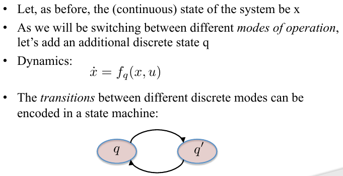
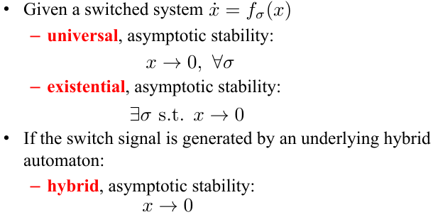

# Lecture 5 - Hybrid Systems

## Lecture 5.1 – Switches Everywhere

### Switches by Necessity

Bipedal walking robots. 
Well, bipedal walking robots have a leg 
that's swinging, has one dynamics, and 
then bam, the leg is on the 
ground, now the dynamics changed. 
So because of the fact that the dynamics 
changes. 
Depending on whether or not you're in the 
swing face, or the stance face. 
The dynamics is different. 

Well, it has 2 modes. 
It's in the air. 
And then it bounces. 
Something new happens. 
The ball gets squished, and then 
it releases again. 

These locusts don't bother anyone during 
what's called a solitary mode. 
And then something happens and they 
switch to a gregarious mode where they 
lump together and devastate harvests 
everywhere. 
and this is a transition that occurs 
because of a lack of food, for instance. 

### Switches by Design

We're switching between different gears 
because we want the car to run more 
smoothly at different RPM's. 

**So we're switching the dynamics not 
because we have to but because it's 
better. **

Here, this is a, a cockpit. 
It's supposed to be representing an 
autopilot on an aircraft where you're 
switching between cruise climb turn land 
takeoff modes. 
So, instead of designing 1 controller 
that takes me from Atlanta, Georgia to 
Stockholm, Sweden. 
You have a bunch of different controllers 
that you're switching through in order to 
do this. 

We have a sensor network here.
Where, in order to preserve power, you're 
turning sensors on and off on purpose. 
So, you're switching by design, rather by 
necessity. 

This is our south driving Georgia Tech 
car that switches between different 
behaviors depending on what's happening 
in the world. 
Here's a mobile robot that switches 
between behaviors depending  
whether or not there are obstacles, I 
wish we worked on snake robotics. 
We're switching between different modes, 
depending on what is going on in the 
environment. 
This is a friend in now, this is the 
sensor network, and this is the aerial 
robot that we've seen, and we're going to 
see more of. 

**In all of these cases, we're going to 
have to switch in order to respond to 
what the world throw's our way.** 

### Issues

- Issue number one is really how do we 
model these switches? How do we model 
systems that aren't staying the same all 
the time. 
- The other question is if these models change, what about 
stability? What about the performance? 
Can we go with our old methods to try to 
understand this? Well, this all boils 
down to the fact, that t does not go to 
infinity, within a single mode. 
Meaning you are not staying in 1 mode 
forever, and stability is defined what 
happens when t goes to infinity, but t 
does not go to infinity in the individual mode. 
- We also have issues of compositionality. 
This is fancy speak for saying, if I have 
multiple modes and multiple controllers, 
how do I put them together? What is the 
way in which they fit together like Lego 
pieces in a big Lego drawing. 
- And, most importantly, are there traps? 
Are there issues that arise because of 
these switches that we don't fully know 
how to deal with. 

***

## Lecture 5.2 – Hybrid Automata

### Modes, Transitions, Guards, and Resets

- What we need are dynamics, individual 
dynamics which are called **modes**. 
- We need **transitions** which tell us
which discrete states are we moving in 
between. 
- We need **guards** which tell us when we're 
going to make these jumps.
- We need **resets** to tell us how these jumps end up 
effecting the state. 

### The Hybrid Automata Model

### HA Example 1 - Thermostat

The thermostat is on the heater is on 
until you reach that temperature, or 
typically, go a little bit above it. 
And then, it turns off, and then you cool 
down, and then, when you're too low, you 
turn it on again. 

Why we need this epsilon?
If we didn't have it, then this guard is 
true. 
And this is guard is immediately true. 
we're just 
going to start spinning around 
indefinitely here. 
So, the little epsilons are important. 

### HA Example 2 – Gear Shift

### HA Example 3 – Behaviors

***

## Lecture 5.3 – A Counter Example

### A Simple 2-Mode System

So, we have asymptotically 
stable systems with oscillations. 

#### Mode 1

Because epsilon is small, you're 
going to get closer and closer to zero 
but slowly. 
And you're going to spiral in like this. 
And, you know, t goes to infinity. 
You're going to end up at the origin 
because you have indeed an asymptotically 
stable system. 
So, A1 is well-behaved. 

#### Mode 2

It also looks like a spiral but instead 
of a tall and skinny spiral, it's a short 
and chunky spiral. 
But the point is we have two stable 
systems. 
Now, let's put them together in a hybrid 
automaton.

#### HA 1

we start at (1,1). I start in mode 1 
until this point where 
x2=0, then I switch to mode 2 which as 
the short and chunky ellipsoid. 
Here, x1 becomes 0 and now I switch to 
mode 1 again, and then switch to mode 2,
to mode 1, and so forth. 
And as we keep doing that, we spiral in, 
and one thing that you're going to notice 
then is that we're actually ending up at 
the origin at a much faster rate. 
So, this system is not just 
asymptotically stable, it's 
asymptotically stabler, which is not a 
word, by the way than the original 
systems, because it actually converges at 
a faster rate. 
So, by switching, we were able to get to 
the origin faster.

#### HA 2

Now, (1,1) is hiding somewhere here and 
what's happening is that we're now 
starting to spiral out. 
So now, here we have, for instance, that 
x1 became zero. 
Now, we're switching to the, the fat 
spiral. 
Here, x1 becomes 0 and we're switching to 
the skinny spiral. 
And in this way, we're going to end up 
getting further and further out. 
And this is indeed an unstable system and 
this is a little bothering to us because 
**I took two stable systems and I put them 
together in a hybrid system, and I got 
instabilities.** 

### Punchlines

And, in fact, it would be nice if we 
could check that either analytically or 
at least in simulation because the hybrid 
world is a little bit scarier than the 
non-hybrid world. 

***

## Lecture 5.4 – Danger, Beware!

**Stable subsystems do not guarantee a stable hybrid system**

### Switched Systems

Universal and existential stability
are the two main ways in which 
people want to deal with switch systems. 
In our case, we don't have, there exists 
a switch signal typically, or for all, we 
have what's called hybrid stability and 
that we actually have a hybrid system 
that is itself generating the switch 
signal and this is known as hybrid 
stability. 
So, x goes to zero, not for any all sigma 
or for all sigma, but for the one that 
happens to be the one that we have in our 
hybrid system. 

### Some Results

Well, there 
is something in nonlinear control known 
as a common Lyapunov function. 
I'm not going to talk about this in this 
course, 
mainly because the common Lyapunov 
function is an elusive beast that you can 
almost never find. 
But theoretically, that's what you're 
going to have to hunt for. 

###Practically Speaking

if we're 
lucky or we have a lot amount of free 
time on our hands, we can go find, or try 
to find these common Lyapunov functions. 
Now, like I said, finding that is really 
more art than science in the sense that 
it's very hard in general to find it. 
So, the most important thing here is 
really, we need to be aware of the fact 
that stable subsystems do not ensure 
asymptotic stability of the hybrid 
systems. 
So, we need to be aware of it and test, 
test, test, test, test. 
The majority of 
the time is spent not on the 
development of the controllers, but on 
testing that the switching logic in 
combination with the controllers does not 
induce instability. 
So, that's what we need to keep an eye 
out for. 

## Lecture 5.5 – The Bouncing Ball

The reason why I want to do this is 
not necessarily because I really like 
balls but because this bouncing ball 
example holds the key to another little 
peculiarity of hybrid systems that we 
should be aware of. 

And in fact, what we're going to say is 
this is the velocity, so 
if the ball is coming down here 
hits the ground then the velocity 
instantaneously flips, it means, that's 
why we have a minus sign there because 
the ball instantaneously flips but we're 
also scaling it with this gamma constant, 
so we're making the velocity change 
direction from downwards to upwards, but 
a little bit less, which means we lost 
some energy in the bounce. 
Well, the position doesn't change in the 
bounce, so this means that my **reset 
condition** is going to be this. 
Now, what's going to happen is I'm going 
to switch from that mode to itself when 
I'm bouncing. 

### The Ball HA

### Solving for the Output

### Time In-Between Bounces?

### Accumulated Bounce Times

### So What?

***
##The Zeno Phenomenon

So, in the last lecture, we investigated 
this innocent-looking model or system, 
which was a ball bouncing on a surface. 
And we saw something rather strange 
there, which was that, that the, the ball 
ended up bouncing an infinite number of 
times in finite time. 
And this is part of another potential 
complication that comes from hyberdizing 
your model, namely, that you have these 
kinds of infinitely many swicthes. 
And this is known as the Zeno Phenomenon. 

The third warning flag is that we 
don't actually know what the system does 
beyond the Zeno point, meaning the 
time up to which we have an infinite 
number of switches. 
So, since we can't really define what the 
system is doing beyond that point, things 
like asymptotic stability is meaningless 
because time is not allowed to really 
progress off to infinity. 

### The Zeno Phenomenon

We have a hare racing a tortoise. And the 
tortoise is a little slower so the 
tortoise gets a head start. 
In fact, the tortoise starts there and 
then, the race is on. 

And at some point, the hare reaches the 
point were the tortoise started from but 
at that point, right, the tortoise has 
moved, not much but it has moved a little 
bit. The race goes on. 

And at some point, the hare catches up to 
where the tortoise was last time but now, 
the tortoise has moved a little bit more, 
not much, and then this repeats. 

The 
paradox is that the hare never catches up 
with the tortoise because every time it 
reaches the step that the tortoise was 
last time, the tortoise would have moved 
a tiny bit. 

Now mathematically, 
this is nothing. 
We know now about convergent series. 
We know that even though there are 
infinitely many of these small intervals 
the sum of them will converge and there 
is indeed a point where the hare will 
catch the tortoise. 
But the problem for us is that if I model 
this as a hybrid system, I have, again, 
infinitely many switches in finite time. 

### Example

In fact, really 
what's happening is that once it hits 0, 
it starts switching like crazy here. 

In practice, it would chatter but in 
theory, it starts switching like crazy 
here and this is actually not good at 
all. 

### Super-Zeno?

Type 1 Zeno, which is what I now 
call the Super-Zeno. It says that you get 
infinitely many switches in a single time 
instant. 
In this case, again, I want to reiterate 
this system came down here 
and then it started switching infinitely 
many times right there. 

Now, type 2 is Zeno by not type 1, 
meaning, you have infinitely many 
switches but you have that over a time 
interval and the bouncing ball is really 
an example of that. 

### Good News and Bad News

* Type 1: It is easy to see if you're 
going to end up in a situation where you 
are going to switch infinitely many times 
at a single time instant. The other good news about type 1 is 
that we can actually deal with it. eg: It should go 
down to zero and then it should stay at 
0. 

* It's hard to detect it, it hard, it's 
hard to remedy it. 
and this is again, a situation where you 
really need to test your system and see 
do I get something like this where you 
start seeing an accumulation of switch 
times. 
And if you do, you need to go back and 
revisit your model. 

***

## Lecture 5.7 – Sliding Mode Control

What, what's the topic of today's 
lecture, and this construction by which 
we can **continue beyond the zeno point in 
the type 1 zeno system**, using something 
that's known as. 
Sliding mode control. 

### Switching Surfaces

Start from f1 when 
I hit this point, well let's say that f1 
is pointing inwards. 
Well on this part of the world I am going 
to be using f2. 
Well, let's say that f2 here points 
outwards. 
This means that when I hit this point 
again, I grind to a halt. 
so this is really what's going on is that 
both of the vector fields both f1 and f2 
point in the wrong direction. 
So f1 points over in to the f2 territory. 
f2 points over in the f1 territory, but 
again it's clear what should really 
happen. 
We should somehow slide along the 
switching surface here. 
That's clear because f1 and f2 are 
pulling in different directions and this 
is why it's known as sliding mode control 
because what we do is we slide along the 
switching surface. 

### Sliding? How?

I want to slide along the surface. 
That should be the right solution. 
Well first of all what are the conditions 
under which I'm going to slide. 
Well f2 needs to point in the positive 
direction of g because on this side g is 
positive. 
So what I'm going to do is I'm going to 
find this thing, the vector that's normal 
to the switching surface and it turns out 
that luckily for us this is the gradient. 
The partial derivative of g with respect 
to x, transpose. 
So, f1 points into negative g territory. 
f2 points into positive g territory. 
if this happens at the switching surface, 
then we have sliding. 

And, one way we can think about this 
object here, it's the derivative of g, in 
the direction f1. 
And this is the derivative of g in the 
direction f2, and there's actually a 
fancy term for this. 
it's called the Lie derivative. 

**But what happens beyond the Zeno point?**

## Lecture 5.8 – Regularizations

We have sliding, how do we compute how we 
slide? And it turns out that this is 
going to be very important when we move 
on to robotics because this occurs quite 
a bit when you actually start running 
robotic navigation systems. 

### The Sliding “Mode”

We also know that both σ need to be 
positive because I'm not allowed to 
always start flowing backwards and they 
also should sum up to 1 because otherwise 
they can go super fast along this 
direction which I typically don't want. 
I want it to respect the dynamics. 

### The Induced Mode

### Regularizations of Type 1 Zeno HA

### Hybrid Systems: In Summary

So, what do we have, we have models, we 
have very rich models which are the 
hybrid automata models. 
We have something what we call Stability 
Awareness or just We're aware of the fact 
that, just because the submodules, or the 
submodes are stable themselves doesn't 
mean that the hybrid system is stable. 
And we need to be aware of it, test for 
it. 
We also have seen zeno as another awkward 
hybridization that occurs. 
Or an awkward phenomenon that can occur 
when you go hybrid. 
we have 2 classes of zeno. 
The first one, which is type 2, which is the bouncing 
ball. 
Infinitely many switch, many switches in 
finite, but not zero time. 
That's bad and scary, and we can't do 
anything about it except, look out for 
it. 
But then, we have type 1. 
And we now know, not only how to check 
for it. 
But how to get around it using these 
things that I call regularizations or the 
induced sliding mode.